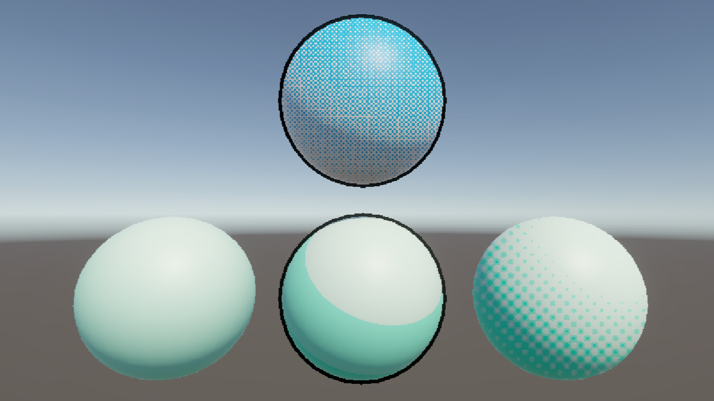

# はじめに
プログラムワークショップIVの管理用です

# 結果画像

- 工夫した点：
- ・背面法による輪郭線の生成を行いました。
- ・時間経過によってハーフトーンが消えたり現れたりすることで、動いて見えるようにしました。
- （動画）https://github.com/deigo6125/PGWS4_6_toon/blob/main/result.mp4
# 進め方

- 本リポジトリをforkしてください
- fork先のリポジトリを更新してください
- Unityのプロジェクトをsrc内で進めてください
- 結果を画面キャプチャして、画像としてリポジトリに追加して、上記のリンクから見られるようにしてください
- 完成したら本リポジトリのmainブランチにpull requestを投げてください
